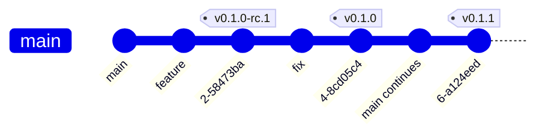

# MatrixHub Release Process

This document describes how maintainers cut releases for MatrixHub. It is intended for [maintainers](../MAINTAINERS.md) and release managers.

## Release versioning

MatrixHub follows [Semantic Versioning](https://semver.org/). Given a version number `<major>.<minor>.<patch>`, increment the:

1. **`<major>`** version when you make incompatible API changes
2. **`<minor>`** version when you add functionality in a backwards compatible manner
3. **`<patch>`** version when you make backwards compatible bug fixes

Pre-release tags use semver pre-release identifiers:

| Tag pattern | Purpose | Container + Helm | Release notes |
|-------------|---------|------------------|---------------|
| `vX.Y.Z-dev.N` | Early integration builds | Yes | **No** |
| `vX.Y.Z-rc.N` | Release candidates | Yes | **No** |
| `vX.Y.Z` | Official release | Yes | **Yes** |

- [Release notes policy](#release-notes-policy)
- [Release candidate process](#release-candidate-process)
- [Official release process](#official-release-process)
- [Patch release process](#patch-release-process)

## Release notes policy

**Release notes are published only for official tags (`vX.Y.Z`).** RC and dev tags do not get release notes, changelogs, or GitHub Releases.

| Version kind | GitHub Releases page | `CHANGELOG/` in repo | What users get |
|--------------|----------------------|----------------------|----------------|
| `-dev` / `-rc` | Nothing new | No update | Installable image + Helm chart only |
| Official `vX.Y.Z` | Published release with notes | Updated | Image, chart, and human-readable release notes |

This matches the [Release workflow](../.github/workflows/release.yml): jobs `release-changelog` and `create-release` run only when the tag matches `vX.Y.Z` (no `-rc` / `-dev` suffix).

**Do not** manually create a GitHub Release for an RC or dev tag. Use RC tags for smoke-testing artifacts; write and publish release notes when cutting the official tag.

### Where release notes come from (Kubernetes-style)

MatrixHub follows the Kubernetes model:

1. **During development:** contributors add a `release-note` block (or `NONE`) in each pull request — this is source material, not a published release note by itself.
2. **At an official release:** maintainers aggregate those PR release notes into [`CHANGELOG/`](../CHANGELOG/) and the [GitHub Releases](https://github.com/matrixhub-ai/matrixhub/releases) page for that version.
3. **RC tags:** skipped — no aggregation and no publication until the official tag.

See [Adding release notes in pull requests](#adding-release-notes-in-pull-requests).

## Tags and branches

MatrixHub releases are tagged from the default branch (`main`) unless a patch is cut from a release branch (see [Cherry-pick patch release](#cherry-pick-patch-release)).



Typical flow:

1. Tag `vX.Y.Z-rc.N` on `main` when the branch is feature-complete for that minor line.
2. Smoke-test the RC artifacts (container image + Helm chart).
3. Tag `vX.Y.Z` on the RC commit (promotion) or on a later `main` commit (if additional fixes landed).
4. Continue development on `main`; cut `vX.Y.(Z+1)` for patch fixes.

A **release branch** (for example `release/0.1`) is **not** required for the first GA or for routine releases from `main`. Create one only when you need a [cherry-pick patch release](#cherry-pick-patch-release) that excludes new features already on `main`.

## Automated release pipeline

Pushing a semver tag (or running the [Release workflow](https://github.com/matrixhub-ai/matrixhub/actions/workflows/release.yml) manually) triggers [`.github/workflows/release.yml`](../.github/workflows/release.yml).

For **every** tag (`-dev`, `-rc`, and official):

1. Build and push a multi-arch container image to `ghcr.io/matrixhub-ai/matrixhub:<tag>`
2. Sign the image with [Cosign](https://docs.sigstore.dev/) (keyless)
3. Generate and attach an SPDX SBOM (Syft)
4. Package the Helm chart and push it to `oci://ghcr.io/matrixhub-ai`

For **official** tags only (`vX.Y.Z` without `-rc` / `-dev`):

5. Build release notes from [`CHANGELOG/`](../CHANGELOG/) via [`scripts/release-notes.sh`](../scripts/release-notes.sh)
6. Create a **draft** [GitHub Release](https://github.com/matrixhub-ai/matrixhub/releases) with the release notes and Helm chart `.tgz` attached

Maintainers must **review and publish** the draft release manually.

`scripts/release-notes.sh` reads the matching section from `CHANGELOG/CHANGELOG-X.Y.md`. If the tagged commit does not yet contain that file (for example when promoting `v0.1.0` on the same commit as `v0.1.0-rc.1`), the script falls back to `origin/main` for the changelog content. **Always verify the draft release body** before publishing — see [Promoting an RC on the same commit](#promoting-an-rc-on-the-same-commit).

### Adding release notes in pull requests

Every pull request with a user-visible change should include a release note in the PR template’s `release-note` block (or `NONE` if not user-facing). Reviewers check release note quality before merge — same idea as [Kubernetes](https://github.com/kubernetes/community/blob/main/contributors/guide/release-notes.md).

Example:

```release-note
Added MatrixHub-type registry configuration for private deployments. (#710, @contributor)
```

These blocks are **not** shown as a versioned release note until an **official** tag is cut. RC tags do not trigger collection or publication.

## Release candidate process

### Overview

A release candidate is e.g. `v0.1.0-rc.1`. Use RC tags to validate install paths and smoke tests before the official `vX.Y.Z` tag.

An RC requires:

- CI green on the commit to be tagged
- Tag the RC
- Verify release workflow succeeded
- Smoke-test image and Helm chart
- Fix blockers on `main`, then cut `vX.Y.Z-rc.(N+1)` or proceed to the official release

### Process

#### Check CI is green

Ensure the commit you plan to tag passes CI on `main` (including relevant E2E jobs).

#### Tag the RC

From your local clone (maintainer with tag push access):

```bash
git fetch origin
git checkout main
git pull origin main
git tag v0.1.0-rc.1
git push origin v0.1.0-rc.1
```

Or create the tag from the GitHub **Releases → Draft a new release → Choose a tag** UI.

Alternatively, run **Actions → Release → Run workflow** and enter the tag name.

#### Verify the pipeline

Open the [Release workflow run](https://github.com/matrixhub-ai/matrixhub/actions/workflows/release.yml) for the new tag and confirm all jobs succeed.

Artifacts produced:

- Container: `ghcr.io/matrixhub-ai/matrixhub:v0.1.0-rc.1`
- Helm chart: `oci://ghcr.io/matrixhub-ai/matrixhub:0.1.0-rc.1`

No GitHub Release, no `CHANGELOG/` update, and no release notes for this tag. The [Releases](https://github.com/matrixhub-ai/matrixhub/releases) page stays unchanged until the official `vX.Y.Z` tag.

#### Smoke-test the RC

Install from the RC tag and run a minimal validation (API health, model pull/push, UI login). See [README](../README.md) for Helm install examples; substitute the RC tag/chart version.

Document any blocking issues as GitHub issues before promoting to an official release.

## Official release process

### Overview

An official (minor or initial) release is e.g. `v0.1.0`.

An official release requires:

- Prepare release notes (aggregate PR `release-note` blocks or bootstrap `CHANGELOG/` for the first GA)
- CI green on the commit to be tagged
- Tag the release (often after a final RC)
- Verify release workflow succeeded
- Review and **publish** the draft GitHub Release (this is where release notes become public)
- Smoke-test the published artifacts
- Announce the release

### Process

#### Prepare release notes

Review merged PRs since the **last official tag** (not since the last RC). Collect non-`NONE` `release-note` blocks into the version section of [`CHANGELOG/`](../CHANGELOG/) (for example `CHANGELOG/CHANGELOG-0.1.md` for the v0.1 line).

For the **first official release** (`v0.1.0`), bootstrap that file manually if historical PRs lack release notes; see the bootstrap step in [Review and publish the GitHub Release](#review-and-publish-the-github-release).

#### Check CI is green

Same as RC: the tagged commit must be green on `main`.

#### Tag the release

**Promote an RC** (same commit as the last RC, no new code):

```bash
git tag v0.1.0 v0.1.0-rc.1^{}
git push origin v0.1.0
```

**Release from current `main`** (includes commits after the last RC):

```bash
git checkout main
git pull origin main
git tag v0.1.0
git push origin v0.1.0
```

#### Promoting an RC on the same commit

When the official tag points at the **same commit** as the last RC (for example `v0.1.0` on `v0.1.0-rc.1`):

- Container images and Helm charts are rebuilt with the official tag name.
- GitHub Actions runs the workflow definitions **from the tagged commit**. If release automation was merged to `main` after that commit, the draft release body may be wrong or empty until `scripts/release-notes.sh` on `main` is used.
- **Before publishing:** confirm the draft body matches the `CHANGELOG/` section for this version (from `main`). Update with `gh release edit` if needed:

```bash
./scripts/release-notes.sh /tmp/release-notes v0.1.0
gh release edit v0.1.0 --notes-file /tmp/release-notes/release_notes_v0.1.0.md
```

For `v0.1.1` and later, tagging the current `main` HEAD avoids this mismatch because the tag commit includes current workflow and changelog files.

#### Verify the pipeline

Confirm the Release workflow completes: image, chart, release-notes artifact (if generated), and draft GitHub Release are created.

Download the workflow artifact `image-digest-artifact-matrixhub-v0.1.0` if you need the exact image digest for release notes.

#### Review and publish the GitHub Release

This step is **only for official tags**. It is what makes release notes visible on the repository [Releases](https://github.com/matrixhub-ai/matrixhub/releases) tab.

1. Open [Releases](https://github.com/matrixhub-ai/matrixhub/releases) and find the **Draft** for `v0.1.0`.
2. Set the body from the `CHANGELOG/` section for this version (or the generated draft); fix gaps, add upgrade notes, and include install commands (below).
3. Confirm the Helm chart `.tgz` is attached.
4. Click **Publish release**.

After publish, users see release notes on the [GitHub Releases](https://github.com/matrixhub-ai/matrixhub/releases) tab; the same content should live under `CHANGELOG/` in the repo for a permanent record.

#### Editing release notes after publish

Release notes are not tied to the container image digest or git tag object. Maintainers may fix typos, add missing items, or clarify upgrade guidance **after** a release is published:

1. Edit the GitHub Release body on the Releases page, **and**
2. Open a PR to update the matching section in `CHANGELOG/CHANGELOG-X.Y.md` so the repo stays the source of truth.

Prefer finalizing notes before publish; post-publish edits should be limited to corrections and clarifications.

Suggested release notes footer (adjust version):

````markdown
## Install

### Container image

```
ghcr.io/matrixhub-ai/matrixhub:v0.1.0
```

Verify signature (optional):

```bash
cosign verify ghcr.io/matrixhub-ai/matrixhub:v0.1.0 \
  --certificate-identity-regexp='.*' \
  --certificate-oidc-issuer=https://token.actions.githubusercontent.com
```

### Helm

```bash
export CHART_VERSION=0.1.0
helm install matrixhub oci://ghcr.io/matrixhub-ai/matrixhub \
  --version "${CHART_VERSION}"
```

See the [documentation site](https://matrixhub.ai) for full install and upgrade guides.
````

#### Smoke-test the release

Repeat smoke tests against the **official** tag (not only the RC).

#### Announce

- Post in [CNCF Slack #matrixhub](https://cloud-native.slack.com/archives/C0A8UKWR8HG)
- Optionally open a [GitHub Discussion](https://github.com/matrixhub-ai/matrixhub/discussions) release announcement
- Update [matrixhub.ai](https://matrixhub.ai) or docs if the release introduces user-visible changes

## Patch release process

### Overview

A patch release is e.g. `v0.1.1`.

#### Simple patch release

If only bug fixes landed on `main` since the last official release (`v0.1.0`) and `main` is stable, follow the [Official release process](#official-release-process) on the current `main` HEAD with the next patch version.

#### Cherry-pick patch release

If `main` contains new features but a patch release (`v0.1.1`) should include **only** fixes relative to `v0.1.0`, use a release branch:

A cherry-pick patch release requires:

- Create (or reuse) a release branch
- Cherry-pick fix commits into the release branch
- Ensure cherry-pick PRs include `release-note` blocks for the patch notes
- Tag the patch on the release branch
- Verify pipeline, publish draft release, smoke-test, announce

##### Create release branch

If it does not exist yet:

```bash
git fetch origin --tags
git checkout -b release/0.1 v0.1.0
git push origin release/0.1
```

##### Cherry-pick fixes

```bash
git checkout release/0.1
git cherry-pick <SHA>   # repeat for each fix
git push origin release/0.1
```

Open a PR into `release/0.1` when cherry-picks need review.

##### Tag patch release

```bash
git checkout release/0.1
git pull origin release/0.1
git tag v0.1.1
git push origin v0.1.1
```

Then follow [Review and publish the GitHub Release](#review-and-publish-the-github-release).

Port documentation or release-note edits back to `main` if needed.

## Security releases

Security fixes follow the same tagging pipeline. Additionally:

1. Follow [SECURITY.md](../SECURITY.md) coordinated disclosure.
2. Prefer a patch tag (`vX.Y.Z`) on the affected release line.
3. Mention the advisory link in the published release notes after disclosure.

## Checklist (maintainers)

Use this quick checklist for every official release:

- [ ] Target commit is green on CI
- [ ] Release notes prepared in `CHANGELOG/` (or draft body edited manually)
- [ ] RC smoke-tested (recommended for minor releases)
- [ ] Tag pushed (`vX.Y.Z`)
- [ ] Release workflow succeeded (image, chart, SBOM, cosign)
- [ ] Draft GitHub Release reviewed and **published**
- [ ] Post-release smoke test passed
- [ ] Community announcement sent
- [ ] Docs / website updated if user-facing behavior changed

## Related links

- [Governance — Releases](../GOVERNANCE.md#releases)
- [Security policy](../SECURITY.md)
- [Maintainers](../MAINTAINERS.md)
- [GitHub Releases](https://github.com/matrixhub-ai/matrixhub/releases)
- [Release workflow](https://github.com/matrixhub-ai/matrixhub/actions/workflows/release.yml)
