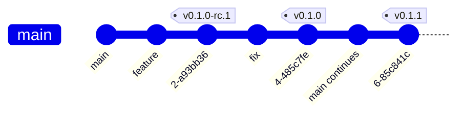

# MatrixHub Release Process

This document describes how maintainers cut releases for MatrixHub. It is intended for [maintainers](../MAINTAINERS.md) and release managers.

## Release versioning

MatrixHub follows [Semantic Versioning](https://semver.org/). Given a version number `<major>.<minor>.<patch>`, increment the:

1. **`<major>`** version when you make incompatible API changes
2. **`<minor>`** version when you add functionality in a backwards compatible manner
3. **`<patch>`** version when you make backwards compatible bug fixes

Pre-release tags use semver pre-release identifiers:

| Tag pattern | Purpose | Container + Helm | Release notes |
|-------------|---------|------------------|---------------|
| `vX.Y.Z-dev.N` | Early integration builds | Yes | **No** |
| `vX.Y.Z-rc.N` | Release candidates | Yes | **No** |
| `vX.Y.Z` | Official release | Yes | **Yes** |

- [Release notes policy](#release-notes-policy)
- [Release candidate process](#release-candidate-process)
- [Official release process](#official-release-process)
- [Patch release process](#patch-release-process)

## Release notes policy

**Release notes are published only for official tags (`vX.Y.Z`).** RC and dev tags do not get release notes, changelogs, or GitHub Releases.

| Version kind | GitHub Releases page | `CHANGELOG/` in repo | What users get |
|--------------|----------------------|----------------------|----------------|
| `-dev` / `-rc` | Nothing new | No update | Installable image + Helm chart only |
| Official `vX.Y.Z` | Published release with notes | Updated | Image, chart, and human-readable release notes |

This matches the [Release workflow](../.github/workflows/release.yml): jobs `release-changelog` and `create-release` run only when the tag matches `vX.Y.Z` (no `-rc` / `-dev` suffix).

**Do not** manually create a GitHub Release for an RC or dev tag. Use RC tags for smoke-testing artifacts; write and publish release notes when cutting the official tag.

### Where release notes come from (Kubernetes-style)

MatrixHub follows the Kubernetes model:

1. Contributors follow
   [Release notes in pull requests](../CONTRIBUTING.md#release-notes-in-pull-requests).
2. The release owner follows [Prepare release notes](#prepare-release-notes) to
   generate, review, and merge the draft changelog PR before the official tag.
3. The Release workflow uses the committed version section for the draft
   [GitHub Release](https://github.com/matrixhub-ai/matrixhub/releases).

## Tags and branches

MatrixHub releases are tagged from the default branch (`main`) unless a patch is cut from a release branch (see [Cherry-pick patch release](#cherry-pick-patch-release)).


```mermaid
gitGraph
  commit id: "main"
  commit id: "feature"
  commit tag: "v0.1.0-rc.1"
  commit id: "fix"
  commit tag: "v0.1.0"
  commit id: "main continues"
  commit tag: "v0.1.1"
```

Typical flow:

1. Tag `vX.Y.Z-rc.N` on `main` when the branch is feature-complete for that minor line.
2. Smoke-test the RC artifacts (container image + Helm chart).
3. Tag `vX.Y.Z` on the RC commit (promotion) or on a later `main` commit (if additional fixes landed).
4. Continue development on `main`; cut `vX.Y.(Z+1)` for patch fixes.

A **release branch** named `release-<minor>` (for example `release-0.1` for the
v0.1 line) is **not** required for the first GA or for routine releases from
`main`. Create one only when you need a [cherry-pick patch release](#cherry-pick-patch-release)
that excludes new features already on `main`.

## Automated release pipeline

Pushing a semver tag (or running the [Release workflow](https://github.com/matrixhub-ai/matrixhub/actions/workflows/release.yml) manually) triggers [`.github/workflows/release.yml`](../.github/workflows/release.yml).

For **every** tag (`-dev`, `-rc`, and official):

1. Build and push a multi-arch container image to `ghcr.io/matrixhub-ai/matrixhub:<tag>`
2. Sign the image with [Cosign](https://docs.sigstore.dev/) (keyless)
3. Generate and attach an SPDX SBOM (Syft)
4. Package the Helm chart and push it to `oci://ghcr.io/matrixhub-ai`

For **official** tags only (`vX.Y.Z` without `-rc` / `-dev`):

5. Build release notes from [`CHANGELOG/`](../CHANGELOG/) via [`scripts/release-notes.sh`](../scripts/release-notes.sh)
6. Create a **draft** [GitHub Release](https://github.com/matrixhub-ai/matrixhub/releases) with the release notes and Helm chart `.tgz` attached

Maintainers must **review and publish** the draft release manually.

`scripts/release-notes.sh` reads the matching section from `CHANGELOG/CHANGELOG-X.Y.md`. If the tagged commit does not yet contain that file (for example when promoting `v0.1.0` on the same commit as `v0.1.0-rc.1`), the script falls back to `origin/main` for the changelog content. **Always verify the draft release body** before publishing — see [Promoting an RC on the same commit](#promoting-an-rc-on-the-same-commit).

## Release candidate process

### Overview

A release candidate is e.g. `v0.1.0-rc.1`. Use RC tags to validate install paths and smoke tests before the official `vX.Y.Z` tag.

An RC requires:

- CI green on the commit to be tagged
- Tag the RC
- Verify release workflow succeeded
- Smoke-test image and Helm chart
- Fix blockers on `main`, then cut `vX.Y.Z-rc.(N+1)` or proceed to the official release

### Process

#### Check CI is green

Ensure the commit you plan to tag passes CI on `main` (including relevant E2E jobs).

#### Tag the RC

From your local clone (maintainer with tag push access):

```bash
git fetch origin
git checkout main
git pull origin main
git tag v0.1.0-rc.1
git push origin v0.1.0-rc.1
```

Or create the tag from the GitHub **Releases → Draft a new release → Choose a tag** UI.

Alternatively, run **Actions → Release → Run workflow** and enter the tag name.

#### Verify the pipeline

Open the [Release workflow run](https://github.com/matrixhub-ai/matrixhub/actions/workflows/release.yml) for the new tag and confirm all jobs succeed.

Artifacts produced:

- Container: `ghcr.io/matrixhub-ai/matrixhub:v0.1.0-rc.1`
- Helm chart: `oci://ghcr.io/matrixhub-ai/matrixhub:0.1.0-rc.1`

No GitHub Release, no `CHANGELOG/` update, and no release notes for this tag. The [Releases](https://github.com/matrixhub-ai/matrixhub/releases) page stays unchanged until the official `vX.Y.Z` tag.

#### Smoke-test the RC

Install from the RC tag and run a minimal validation (API health, model pull/push, UI login). See [README](../README.md) for Helm install examples; substitute the RC tag/chart version.

Document any blocking issues as GitHub issues before promoting to an official release.

## Official release process

### Overview

An official (minor or initial) release is e.g. `v0.1.0`.

An official release requires:

- Generate, review, and merge the release-notes PR (or bootstrap `CHANGELOG/` for the first GA)
- CI green on the commit to be tagged
- Tag the release (often after a final RC)
- Verify release workflow succeeded
- Review and **publish** the draft GitHub Release (this is where release notes become public)
- Smoke-test the published artifacts
- Announce the release

### Process

#### Prepare release notes

Create the draft around feature freeze or the first RC:

1. Open the repository's [**Actions**](https://github.com/matrixhub-ai/matrixhub/actions)
   tab.
2. In the left sidebar, select **Prepare Release Notes**.
3. Above the workflow runs, click **Run workflow** to open the form.
4. Select the branch containing the workflow, normally `main`, then fill in:
   - **version:** the official `vX.Y.Z` version;
   - **base_branch:** the branch that receives the changelog PR (and is later
     tagged), normally `main`;
   - **start_ref:** previous official tag, or leave empty to auto-detect;
   - **end_ref:** leave empty to collect through `base_branch` HEAD. Set a tag
     or commit to freeze the range, for example `v0.1.0` → `v0.2.0-rc.5` while
     still opening the draft PR against `main`.
5. Click the green **Run workflow** button in the form.
6. When the run succeeds, review the draft PR from `release-notes/vX.Y.Z`. Add
   hand-written content outside the generated markers.
7. If validation fails, fix the reported PR metadata and rerun. Rerun again after
   late fixes, then mark the PR ready and merge it before creating the official tag.

The workflow opens a **same-repository** draft PR
(`release-notes/vX.Y.Z` → `base_branch`), not a fork PR. That is an intentional
bot exception, like Dependabot: the
[branch-creation ruleset](https://github.com/matrixhub-ai/matrixhub/rules/13536899)
must keep `refs/heads/release-notes/**` in its exclude list so Actions can push
the notes branch. Do not rename it to `release-*`; those branches are protected
for patch releases and disallow force-push.

The workflow collects changes since the previous official tag, omits `NONE`/`NO`
entries, and updates `CHANGELOG/CHANGELOG-X.Y.md`. For the first official release,
backfill old PR metadata or prepare the initial section manually.

#### Check CI is green

Same as RC: the tagged commit must be green on `main`.

#### Tag the release

**Promote an RC** (same commit as the last RC, no new code):

```bash
git tag v0.1.0 v0.1.0-rc.1^{}
git push origin v0.1.0
```

**Release from current `main`** (includes commits after the last RC):

```bash
git checkout main
git pull origin main
git tag v0.1.0
git push origin v0.1.0
```

#### Promoting an RC on the same commit

When the official tag points at the **same commit** as the last RC (for example `v0.1.0` on `v0.1.0-rc.1`):

- Container images and Helm charts are rebuilt with the official tag name.
- GitHub Actions runs the workflow definitions **from the tagged commit**. If release automation was merged to `main` after that commit, the draft release body may be wrong or empty until `scripts/release-notes.sh` on `main` is used.
- **Before publishing:** confirm the draft body matches the `CHANGELOG/` section for this version (from `main`). Update with `gh release edit` if needed:

```bash
./scripts/release-notes.sh /tmp/release-notes v0.1.0
gh release edit v0.1.0 --notes-file /tmp/release-notes/release_notes_v0.1.0.md
```

For `v0.1.1` and later, tagging the current `main` HEAD avoids this mismatch because the tag commit includes current workflow and changelog files.

#### Verify the pipeline

Confirm the Release workflow completes: image, chart, release-notes artifact (if generated), and draft GitHub Release are created.

Download the workflow artifact `image-digest-artifact-matrixhub-v0.1.0` if you need the exact image digest for release notes.

#### Review and publish the GitHub Release

This step is **only for official tags**. It is what makes release notes visible on the repository [Releases](https://github.com/matrixhub-ai/matrixhub/releases) tab.

1. Open [Releases](https://github.com/matrixhub-ai/matrixhub/releases) and find the **Draft** for `v0.1.0`.
2. Set the body from the `CHANGELOG/` section for this version (or the generated draft); fix gaps, add upgrade notes, and include install commands (below).
3. Confirm the Helm chart `.tgz` is attached.
4. Click **Publish release**.

After publish, users see release notes on the [GitHub Releases](https://github.com/matrixhub-ai/matrixhub/releases) tab; the same content should live under `CHANGELOG/` in the repo for a permanent record.

#### Editing release notes after publish

Release notes are not tied to the container image digest or git tag object. Maintainers may fix typos, add missing items, or clarify upgrade guidance **after** a release is published:

1. Edit the GitHub Release body on the Releases page, **and**
2. Open a PR to update the matching section in `CHANGELOG/CHANGELOG-X.Y.md` so the repo stays the source of truth.

Prefer finalizing notes before publish; post-publish edits should be limited to corrections and clarifications.

Suggested release notes footer (adjust version):

````markdown
## Install

### Container image

```
ghcr.io/matrixhub-ai/matrixhub:v0.1.0
```

Verify signature (optional):

```bash
cosign verify ghcr.io/matrixhub-ai/matrixhub:v0.1.0 \
  --certificate-identity-regexp='.*' \
  --certificate-oidc-issuer=https://token.actions.githubusercontent.com
```

### Helm

```bash
export CHART_VERSION=0.1.0
helm install matrixhub oci://ghcr.io/matrixhub-ai/matrixhub \
  --version "${CHART_VERSION}"
```

See the [documentation site](https://matrixhub.ai) for full install and upgrade guides.
````

#### Smoke-test the release

Repeat smoke tests against the **official** tag (not only the RC).

#### Announce

- Post in [CNCF Slack #matrixhub](https://cloud-native.slack.com/archives/C0A8UKWR8HG)
- Optionally open a [GitHub Discussion](https://github.com/matrixhub-ai/matrixhub/discussions) release announcement
- Update [matrixhub.ai](https://matrixhub.ai) or docs if the release introduces user-visible changes

## Patch release process

### Overview

A patch release is e.g. `v0.1.1`.

#### Simple patch release

If only bug fixes landed on `main` since the last official release (`v0.1.0`) and `main` is stable, follow the [Official release process](#official-release-process) on the current `main` HEAD with the next patch version.

#### Cherry-pick patch release

If `main` contains new features but a patch release (`v0.1.1`) should include **only** fixes relative to `v0.1.0`, use a release branch:

A cherry-pick patch release requires:

- Create (or reuse) a release branch
- Merge fixes through PRs targeting the release branch
- Generate, review, and merge the release-notes PR
- Tag the patch on the release branch
- Verify pipeline, publish draft release, smoke-test, announce

##### Create release branch

If it does not exist yet:

```bash
git fetch origin --tags
git checkout -b release-0.1 v0.1.0
git push origin release-0.1
```

##### Cherry-pick fixes

```bash
git checkout -b backport-fix release-0.1
git cherry-pick <SHA>
git push origin HEAD
```

Open a PR into `release-0.1`, complete its `/kind` and `release-note` metadata,
and merge it after CI passes.

> **CI parity:** PRs (and pushes) to a `release-*` branch run the same gating CI as
> `main` — Unit tests, Go Lint, govulncheck, CodeQL, Workflow Lint, and Website tests,
> subject to their path filters. Cherry-pick PRs into a release branch **must be green
> under these same checks as `main`** before merge, so the commit you tag from the
> release line is CI-green. The workflows list `main` and `release-*` in their
> `branches` filters; keep any new gating workflow aligned with this pattern.

##### Prepare patch release notes

Follow [Prepare release notes](#prepare-release-notes), using version `v0.1.1` and
base branch `release-0.1`.

##### Tag patch release

```bash
git checkout release-0.1
git pull origin release-0.1
git tag v0.1.1
git push origin v0.1.1
```

Then follow [Review and publish the GitHub Release](#review-and-publish-the-github-release).

Port documentation or release-note edits back to `main` if needed.

## Security releases

Security fixes follow the same tagging pipeline. Additionally:

1. Follow [SECURITY.md](../SECURITY.md) coordinated disclosure.
2. Prefer a patch tag (`vX.Y.Z`) on the affected release line.
3. Mention the advisory link in the published release notes after disclosure.

## Checklist (maintainers)

Use this quick checklist for every official release:

- [ ] Target commit is green on CI
- [ ] Generated release-notes PR reviewed, finalized, and merged into the branch
      being tagged
- [ ] RC smoke-tested (recommended for minor releases)
- [ ] Tag pushed (`vX.Y.Z`)
- [ ] Release workflow succeeded (image, chart, SBOM, cosign)
- [ ] Draft GitHub Release reviewed and **published**
- [ ] Post-release smoke test passed
- [ ] Community announcement sent
- [ ] Docs / website updated if user-facing behavior changed

## Related links

- [Governance — Releases](../GOVERNANCE.md#releases)
- [Security policy](../SECURITY.md)
- [Maintainers](../MAINTAINERS.md)
- [GitHub Releases](https://github.com/matrixhub-ai/matrixhub/releases)
- [Release workflow](https://github.com/matrixhub-ai/matrixhub/actions/workflows/release.yml)
- [Prepare Release Notes workflow](https://github.com/matrixhub-ai/matrixhub/actions/workflows/prepare-release-notes.yml)
