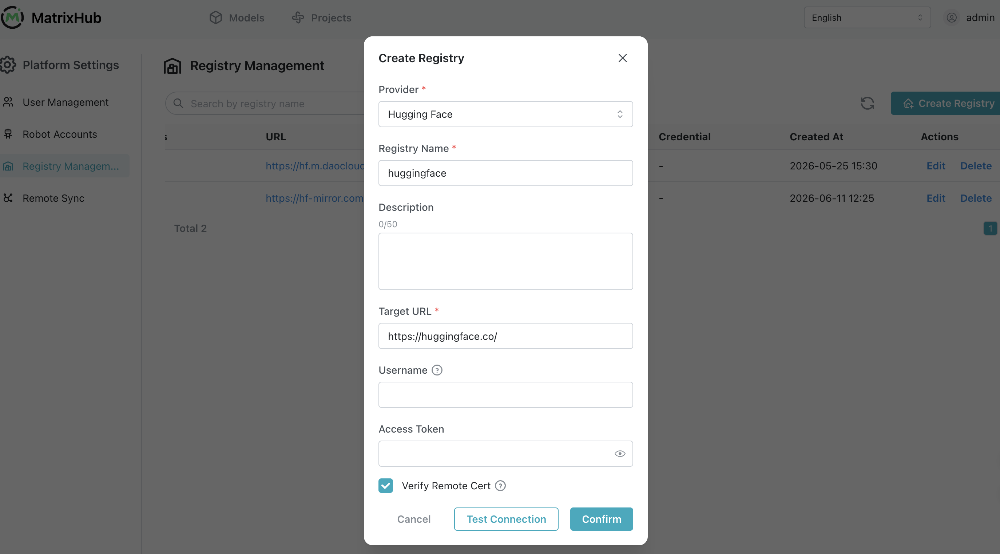
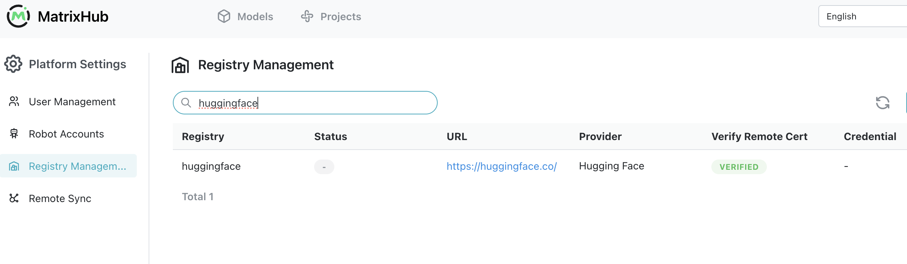
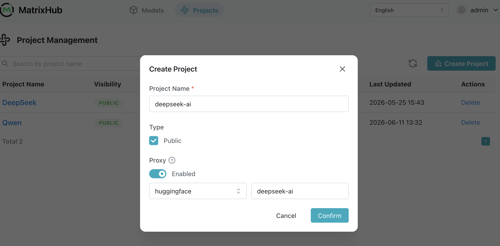
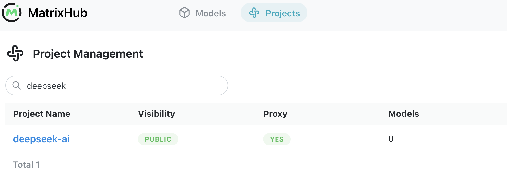
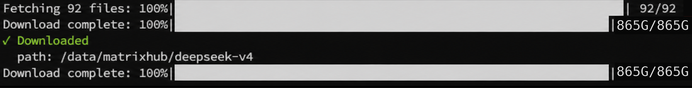
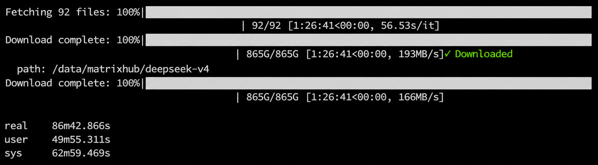
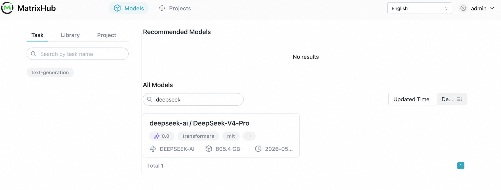
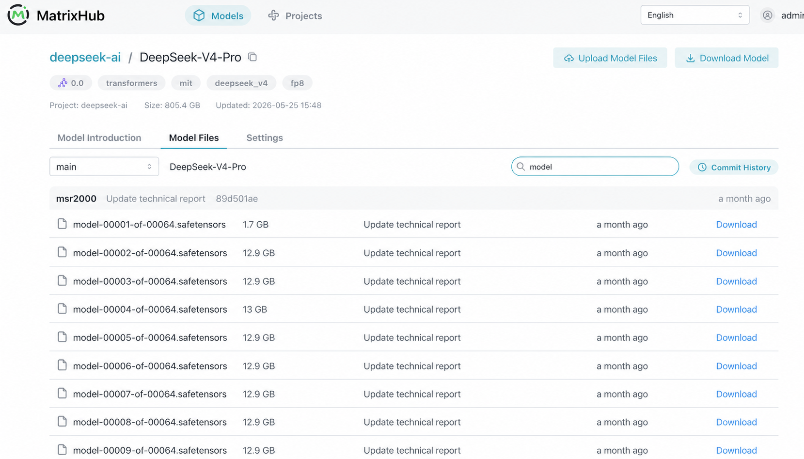

Recently, DeepSeek released DeepSeek v4, and many teams rushed to integrate it.

But if you're operating in an enterprise environment, especially air-gapped or private deployments, you'll quickly realize one thing:

> The model is not the biggest problem. Distribution is.

During our attempt to deploy DeepSeek v4 in an internal network, we ran into a lot of issues. In the end, they can all be boiled down to three fundamental problems.

<!-- truncate -->

## 1. You think it's a download problem, but it's actually an architecture problem

### Hugging Face doesn't work well in enterprise environments

- Unstable or completely unavailable network
- Slow downloads and large-file interruptions
- Lack of access control

It looks like a slow-download issue, but in reality:

> Hugging Face is built for research collaboration, not controlled enterprise distribution.

## 2. You try to fix it yourself, but make it worse

### Common workarounds all break down

- Manual file transfer leads to version chaos and no auditability
- NFS and NAS hit IO bottlenecks and still have no caching
- Each node downloading independently exhausts bandwidth and slows cold starts

Especially in vLLM and SGLang scenarios:

> Every node downloading the same model multiplies bandwidth pressure by N.

## 3. The real problem is actually just one thing

All these issues can be summarized in one sentence:

> You're missing a model distribution infrastructure layer, like a container registry for model artifacts.

Just like you wouldn't use Docker Hub directly in production, you'd use a private registry instead. But in the model world, this layer has been missing for a long time.

## 4. Our solution

### Core idea

```text
Public Model Source (Hugging Face)
        ↓
Proxy / Caching Layer
        ↓
Unified Internal Distribution
        ↓
vLLM / Inference Services
```

This follows a pattern that has already been proven elsewhere:

- Docker -> Docker Hub -> Harbor
- Maven -> Central -> Nexus
- PyPI -> pip -> Private Registry

Model distribution is fundamentally the same kind of problem.

### Key capabilities

This distribution layer should provide:

1. Proxy access to Hugging Face, not a replacement
2. Automatic model caching
3. Resume support for interrupted transfers
4. Access control and permissions
5. Internal network distribution
6. Compatibility with vLLM and SGLang

## 5. We built it into a project

[MatrixHub](https://github.com/matrixhub-ai/matrixhub) is essentially:

> An enterprise-grade Hugging Face proxy and model distribution acceleration layer.

It provides:

- A Hugging Face proxy for public-network constraints
- A model cache layer to eliminate repeated downloads
- A unified enterprise access entry for permissions and governance

You can think of it as:

- Harbor for models
- The container registry of the AI era

## 6. Quick start

### Step 1: Start the service

Download <a href="/deploy/docker/docker-compose.yaml" download="docker-compose.yaml">`docker-compose.yaml`</a> and <a href="/deploy/docker/config.yaml" download="config.yaml">`config.yaml`</a>, and make sure the two files are in the same folder.

```bash
docker compose -f docker-compose.yaml up -d
```

Default service endpoint:

```text
http://127.0.0.1:3001
```

Verify:

```bash
curl http://127.0.0.1:3001
```

### Step 2: Login

- Username: `admin`
- Password: `changeme`

Change the password immediately.


### Step 3: Create a remote registry to proxy Hugging Face

Key configuration:

```text
Remote URL: https://hf-mirror.com ( or https://huggingface.co )
Type: HuggingFace
Recommended name: huggingface
```

How it works:

```text
Request -> MatrixHub -> Hugging Face -> Response
```





### Step 4: Create a proxy project

Purpose:

```text
User -> Proxy Project -> Remote Repo (HF) -> Cache
```

When creating the project:

- Select the `huggingface` remote registry
- Specify the model organization: `deepseek-ai`





### Step 5: Client integration

```bash
export HF_ENDPOINT="http://127.0.0.1:3001"
```


What this does:

- Redirects client requests
- Lets the first request fetch from Hugging Face
- Automatically caches locally
- Keeps all later requests inside the intranet

### Step 6: Download the model

#### 6.1 Start the download

```bash
hf download deepseek-ai/DeepSeek-V4-Pro
```

#### 6.2 First node: populate the cache

In our test environment, the first download took **6 hours and 56 minutes**. This initial request fetched the model from the upstream Hugging Face source and populated the MatrixHub cache. Replace <abbr title="Replace this with your actual MatrixHub service address"><code>http://x.x.x.x:3001</code></abbr> with your actual MatrixHub service address.

```bash
root@node1:/data/matrixhub# export HF_ENDPOINT="http://x.x.x.x:3001"
root@node1:/data/matrixhub# export HF_HUB_DOWNLOAD_TIMEOUT=120
root@node1:/data/matrixhub# nohup time -p hf download deepseek-ai/DeepSeek-V4-Pro --local-dir /data/matrixhub/deepseek-v4
```



#### 6.3 Second node: reuse the cached model

The second download, from another node in the same internal network, completed in **86 minutes** because the model files were already cached by MatrixHub.

```bash
root@node2:/data/matrixhub# export HF_ENDPOINT="http://x.x.x.x:3001"
root@node2:/data/matrixhub# export HF_HUB_DOWNLOAD_TIMEOUT=120
root@node2:/data/matrixhub# time hf download deepseek-ai/DeepSeek-V4-Pro --local-dir /data/matrixhub/deepseek-v4
```



#### 6.4 Verify the model in the UI

After the download finishes, you can see the `DeepSeek-V4-Pro` model under the `deepseek-ai` project in the UI.



#### 6.5 Inspect cached model files

Open the model details page to inspect the cached files and verify that the artifacts are available for internal distribution.



## Verify cache effectiveness

Use `curl` to observe request behavior.

### First request: cache miss

```bash
curl -I http://127.0.0.1:3001/deepseek-ai/DeepSeek-V4-Pro/resolve/main/config.json
```

Characteristics:

- Longer response time
- Contains upstream headers

### Second request: cache hit

```bash
curl -I http://127.0.0.1:3001/deepseek-ai/DeepSeek-V4-Pro/resolve/main/config.json
```

Characteristics:

- Very fast response
- No longer hits Hugging Face

## Final thoughts

If you're deploying large models in an enterprise environment, you will inevitably face:

- Slow downloads
- Bandwidth exhaustion
- Repeated downloads across nodes
- Lack of access control

These are not edge cases. They are architectural gaps.

MatrixHub simply fills that missing layer.

If you're working on similar problems, feel free to connect:

[https://github.com/matrixhub-ai/matrixhub](https://github.com/matrixhub-ai/matrixhub)
