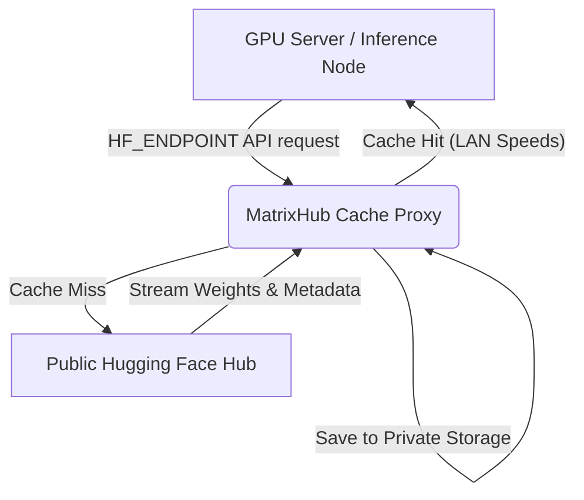

# Concepts

This section explains the core architecture, design patterns, and operational concepts behind MatrixHub. Understanding these concepts helps in successfully running and scaling private registry workflows.

---

## 1. On-Demand Proxy Caching (Intranet Acceleration)

MatrixHub sits as a caching proxy between your internal computing clusters and public model registries (like Hugging Face or ModelScope). 



*   **Transparent Caching**: Upon the first request for a model (e.g. `meta-llama/Llama-3-70B`), MatrixHub intercepts the API call, downloads the metadata and weights from the public registry, and persists them to your configured private storage backend (local disk, NFS, or S3-compatible bucket).
*   **Pull-Once, Serve-All**: All subsequent requests from other GPU servers inside your internal network hit MatrixHub directly, loading weights at local LAN speeds (10Gbps+) instead of bottlenecking your public internet connection.

---

## 2. Immutable Tag Locking & Asset Governance

In standard Hugging Face workflows, model branches can be updated with force-pushes, creating consistency issues across different development stages.

*   **Tag Locking**: MatrixHub treats fine-tuned weights as production-grade release artifacts. Once a model tag is locked (e.g., `v1.0.0`), it becomes **immutable**. Any attempt to overwrite or force-push to that tag is rejected.
*   **Promotion Pipelines**: You can promote models across isolated projects (e.g., from `development` to `staging` to `production`) ensuring that the exact same model weights verified by your QA teams are the ones that land in your production serving cluster.

---

## 3. Air-Gapped Delivery Pipeline

Many highly regulated industries (finance, health, government) operate on secure, isolated networks with no internet connection.

```text
+------------------------+                  +-------------------------+
| Connected Environment  |  Export Package  |  Isolated Environment   |
|  [MatrixHub Staging]   |===============>  | [MatrixHub Production]  |
| (Mirror Public Models) |  (DMZ Transfer)  | (Zero-internet Serving) |
+------------------------+                  +-------------------------+
```

1.  **Staging Mirroring**: Platform engineers mirror public models into a MatrixHub registry operating in a staging environment connected to the internet.
2.  **Package Exporting**: The mirrored model is packed into an exported transfer file containing validated weights, architectures, and signatures.
3.  **Physical Air-Gap Transfer**: The export package is moved across the boundary (DMZ, security review, or physical storage media) and imported into the isolated production network.
4.  **Local Serving**: Internal users access the same exact models in production using local `HF_ENDPOINT` endpoints without a byte of internet traffic.

---

## 4. Multi-Region Replication Engine

For companies with global or multi-datacenter operations, localizing model copies across regional GPU clusters is critical to minimize latency and WAN network congestion.

*   **Asynchronous Policy Replication**: Set policies to automatically synchronize specific namespaces or tags across regional registries.
*   **Chunked & Resumable Transfer**: Models can be tens of gigabytes in size. MatrixHub breaks files into chunks, utilizing checksums to resume synchronization seamlessly after any WAN disruptions.

---

## 5. Security & Multi-Tenancy Partitioning

MatrixHub partitions resources into secure scopes:

*   **Workspace Projects**: Logical boundaries isolating model repositories, tokens, and audit trails.
*   **Granular RBAC**: 
    *   **Owner**: Full admin access to repositories, member permissions, and namespace integration settings.
    *   **Manager**: Can write model files, commit tag locks, and edit project parameters.
    *   **Reporter**: Read-only access to download cached weights.
*   **Audit Compliance**: Transparently logs every single upload, download, model promotion, and settings update.
