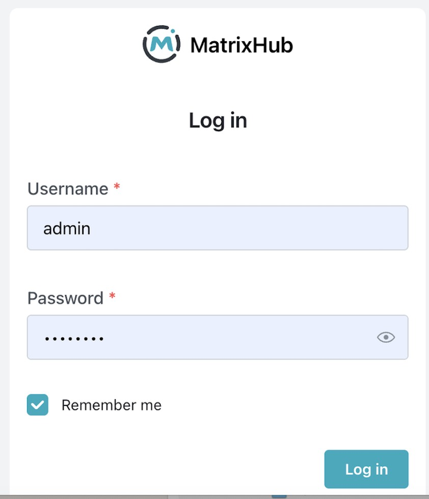
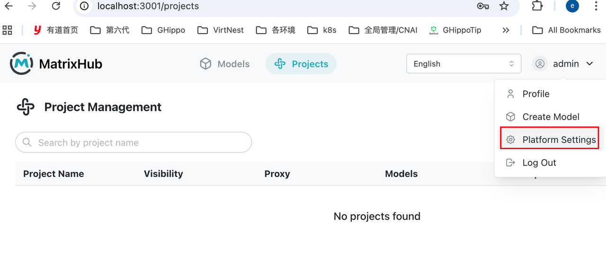
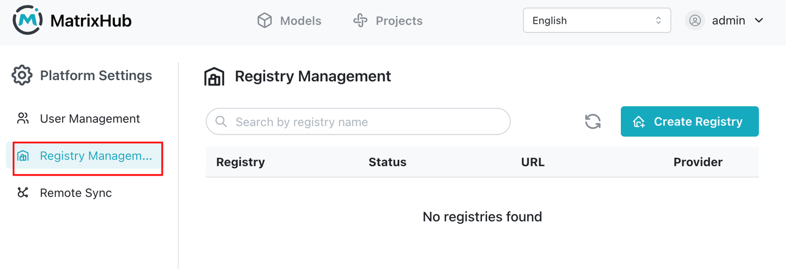
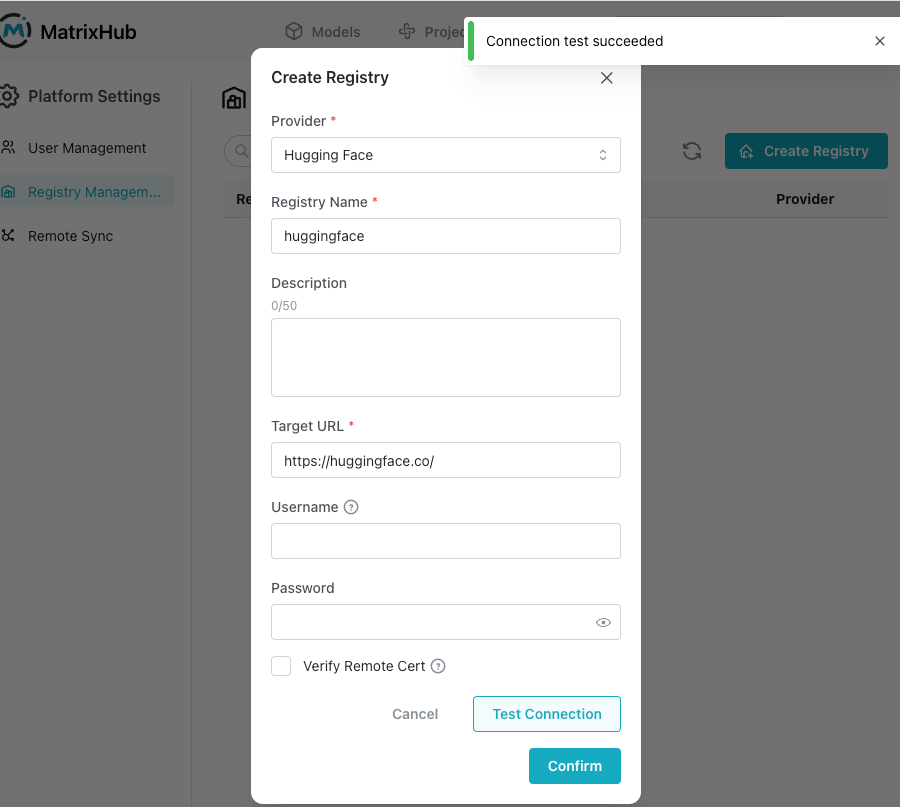
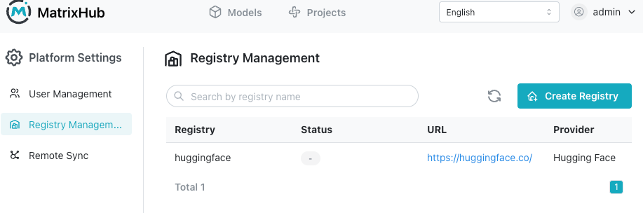
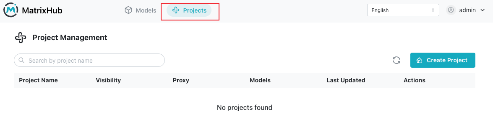
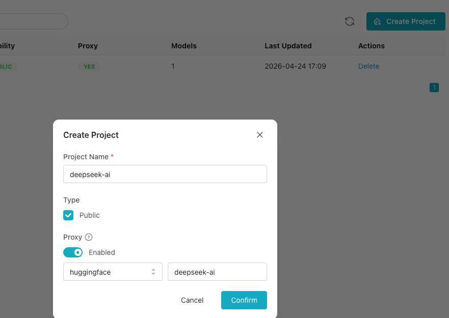
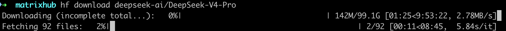
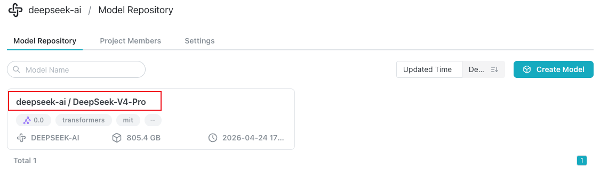

最近 DeepSeek 发布了 DeepSeek v4，不少团队都在第一时间尝试接入。

但如果你是在企业环境，尤其是内网或私有化部署里，很快就会发现一件事：

> 模型不是最大的问题，分发才是。

我们在内网落地 DeepSeek v4，踩了一堆坑，整理下来，本质其实就三类问题。

<!-- truncate -->

## 一、你以为是“下载问题”，其实是架构问题

### Hugging Face 在企业环境并不好用

- 网络不稳定甚至断网
- 下载慢，大文件容易中断
- 权限不可控

看起来是“下载慢”，本质是：

> Hugging Face 不是为企业分发设计的，它的设计目标是研究协作，不是企业分发。

## 二、你开始自救，但问题更大

### 常见方案都会踩坑

- 手动拷贝会带来版本混乱，也不可审计
- NFS 和 NAS 会遇到 IO 瓶颈，而且没有缓存层
- 每台机器各自下载会迅速耗尽带宽，冷启动也会更慢

尤其在 vLLM 和 SGLang 场景下：

> 每个节点都在重复下载模型，会把带宽压力放大 N 倍。

## 三、真正的问题其实只有一个

所有问题，本质都可以归结为一句话：

> 缺一个“模型分发基础设施层”，就像容器依赖镜像仓库一样。

就像你不会在生产里直接用 Docker Hub，而是会用私有镜像仓库一样。但在模型领域，这一层长期是缺失的。

## 四、我们的解法

### 核心思路

```text
公网模型源（Hugging Face）
        ↓
模型代理 / 缓存层
        ↓
企业内部统一分发
        ↓
vLLM / 推理服务
```

这个架构其实复用了一个已经被验证过的模式：

- Docker -> Docker Hub -> Harbor
- Maven -> Central -> Nexus
- PyPI -> pip -> 私有仓库

模型分发，本质是同一类问题。

### 关键能力

这个分发层需要：

1. 代理 Hugging Face，而不是替代它
2. 自动缓存模型
3. 支持断点续传
4. 支持权限控制
5. 支持内网分发
6. 兼容 vLLM 和 SGLang

## 五、我们把它做成了一个项目

[MatrixHub](https://github.com/matrixhub-ai/matrixhub) 本质上就是：

> 企业版 Hugging Face 代理 + 模型分发加速层。

它提供：

- Hugging Face 代理，解决公网访问问题
- 模型缓存层，减少重复下载
- 企业统一接入入口，处理权限和治理

你可以把它理解为：

- 模型领域的 Harbor
- 或者 AI 时代的镜像仓库

## 六、快速上手

### Step 1：启动服务

下载 <a href="/deploy/docker/docker-compose.yaml" download="docker-compose.yaml">`docker-compose.yaml`</a> 和 <a href="/deploy/docker/config.yaml" download="config.yaml">`config.yaml`</a>，并保证二者在同一目录下。

```bash
docker compose -f docker-compose.yaml up -d
```

默认服务地址：

```text
http://127.0.0.1:3001
```

验证：

```bash
curl http://127.0.0.1:3001
```

### Step 2：登录

- 用户名：`admin`
- 密码：`changeme`

建议立即修改密码。



### Step 3：创建远程仓库

关键配置：

```text
Remote URL: https://hf-mirror.com ( 或 https://huggingface.co )
Type: HuggingFace
推荐名称：huggingface
```

作用：

```text
请求 -> MatrixHub -> Hugging Face -> 回源
```






### Step 4：创建 Proxy 项目

作用：

```text
用户 -> 代理项目 -> 远程仓库（HF） -> 缓存
```

创建项目时：

- 选择刚才创建的 `huggingface` 远程仓库
- 填写代理模型组织：`deepseek-ai`




### Step 5：客户端接入

```bash
export HF_ENDPOINT="http://127.0.0.1:3001"
```

本质上是在做这几件事：

- 劫持客户端请求
- 首次请求回源 Hugging Face
- 自动缓存到本地
- 后续请求全部走内网


### Step 6：下载模型

```bash
hf download deepseek-ai/DeepSeek-V4-Pro
```


下载完成后，进入‘deepseek-ai' 项目可以看到 DeepSeek-V4-Pro 模型在页面上出现.


## 验证缓存是否生效

用 `curl` 看请求行为。

### 第一次请求：回源

```bash
curl -I http://127.0.0.1:3001/deepseek-ai/DeepSeek-V4-Pro/resolve/main/config.json
```

特征：

- 请求时间较长
- 会带有上游响应头

### 第二次请求：命中缓存

```bash
curl -I http://127.0.0.1:3001/deepseek-ai/DeepSeek-V4-Pro/resolve/main/config.json
```

特征：

- 响应很快
- 不再访问 Hugging Face

## 写在最后

如果你也在企业内网落地大模型，一定会遇到这些问题：

- 下载慢
- 带宽炸
- 节点重复拉取
- 权限不可控

这些都不是偶发问题，而是架构缺失。

MatrixHub 只是把这件事补上了。

如果你正在做类似事情，欢迎交流：

[https://github.com/matrixhub-ai/matrixhub](https://github.com/matrixhub-ai/matrixhub)
