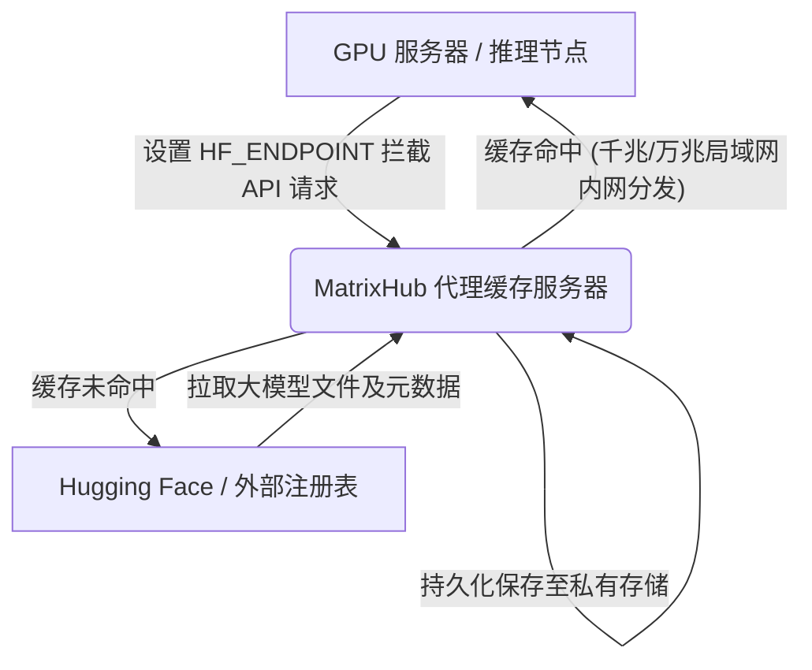

# 核心概念

本章节将为您深入剖析 MatrixHub 的核心架构设计模式、系统运行机理及底层技术概念。掌握这些概念能协助您更加高效地部署、调优与运维企业级私有模型注册表服务。

---

## 1. 按需代理缓存 (内网推理加速)

MatrixHub 充当您的内部 GPU 计算集群与外部公网模型注册表（如 Hugging Face 或 ModelScope）之间的智能缓存网关。



*   **透明拦截机制**：当第一个 GPU 计算节点发起对某一模型（例如 `meta-llama/Llama-3-70B`）的读取请求时，MatrixHub 会自动拦截该请求，并代为从公网源静默下载元数据和大文件权重，然后将其持久化持久保存至您预先配好的私有存储底座上（本地磁盘、NFS 或 S3/MinIO 对象存储）。
*   **一次拉取，全网消费**：一旦该模型在 MatrixHub 中被本地化成功，后续其他推理节点在访问相同模型时，都会被自动路由到 MatrixHub 本地缓存上，直接通过万兆内网极速拉取权重，彻底解决多节点并发启动时的外部公网带宽挤兑痛点。

---

## 2. 不可变标签锁定与模型资产治理

在公网 Hugging Face 工作流中，分支的提交哈希是可变的（可以通过 force-push 强行覆盖），这会导致模型生命周期（开发、测试、生产）中的参数版本产生不一致。

*   **标签锁定 (Tag Locking)**：MatrixHub 将微调好的大模型权重视为高严肃性的生产级发布制品。一旦某个版本标签（例如 `v1.0.0`）被执行了标签锁定，该版本文件就变为了**不可变资产**。任何对此版本的修改、篡改或强推覆盖都会被系统拒绝。
*   **晋升流管道**：您可以将已锁定的模型资产，在逻辑隔离的项目空间内逐步晋升（例如从 `dev` 项目到 `staging` 项目，最终推进至 `prod` 生产项目），确保在生产中运行的权重和 QA 验证过的参数完全一致。

---

## 3. 离线物理隔离网络传输

国防、金融、政府等高监管要求行业往往运行在完全切断互联网连接的物理隔离内网中。

```text
+--------------------------+                  +---------------------------+
|    具备公网连接的环境     | 导出安全数据包   |    完全物理隔离的内网     |
|   [MatrixHub Staging]    |===============>  |  [MatrixHub Production]   |
| (拉取公网模型完成本地化) | (安全审查/U盘媒介) | (零外部带宽、高性能推理)  |
+--------------------------+                  +---------------------------+
```

1.  **Staging 预存**：运维人员在具有外网连接的安全缓冲区部署 MatrixHub Staging 实例，拉取并预存所需的开源模型。
2.  **数据打包导出**：管理员使用 MatrixHub 提供的导出功能，一键将目标模型压缩为加密校验的离线交付包。
3.  **安全审查与介质拷贝**：离线交付包通过安全部门的安全漏洞与木马扫描后，利用物理介质（如安全优盘、隔离网闸）移入高保密级内网。
4.  **内网导入与发布**：在隔离内网部署的 MatrixHub 生产实例一键导入该数据包，内部算法人员即刻可以通过相同的兼容接口直接访问模型，没有任何网络隐患。

---

## 4. 跨地域分布式复制引擎

对于拥有多个计算数据中心、多地协同的大型企业，将模型资产快速安全分发至异地 GPU 算力集群至关重要。

*   **策略驱动异步同步**：您可以灵活定义同步策略（如自动将特定 namespace 或特定 Tag 下的模型同步至欧洲或亚太区数据中心）。
*   **分块并发与断点续传**：大模型权重大多高达数十上百 GB，网络抖动极易导致传输中断。MatrixHub 自动将大文件拆分为块，建立强校验的索引表，网络恢复后无缝支持断点续传，无需从头开始。

---

## 5. 项目级隔离与 RBAC 权限体系

为了让不同算法团队与项目互不干扰，MatrixHub 实现了完备的安全逻辑划分：

*   **逻辑项目隔离**：每个项目（Project）是模型仓库、API Key、操作审计日志的独立物理/逻辑边界。
*   **细粒度角色设计**：
    *   **拥有者 (Owner)**：拥有最高管理权限，可删除项目、管理项目成员与全局集成配置。
    *   **管理员 (Manager)**：拥有读写修改权限，可上传下载模型、提交 Tag 锁和编辑项目仓库参数。
    *   **访问者 (Reporter)**：拥有只读权限，可获取访问 Token 用以从推理节点中下载并部署模型。
*   **企业级合规审计**：高保真记录任何模型上传、下载、标签锁定、配置覆盖等重大系统日志，全链路可追溯。
