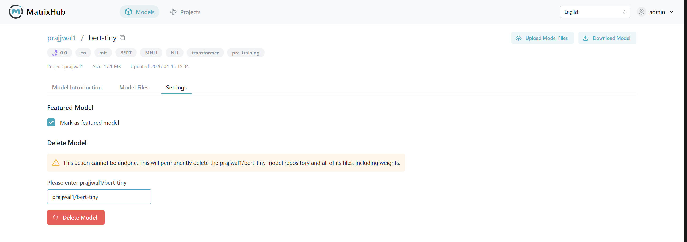
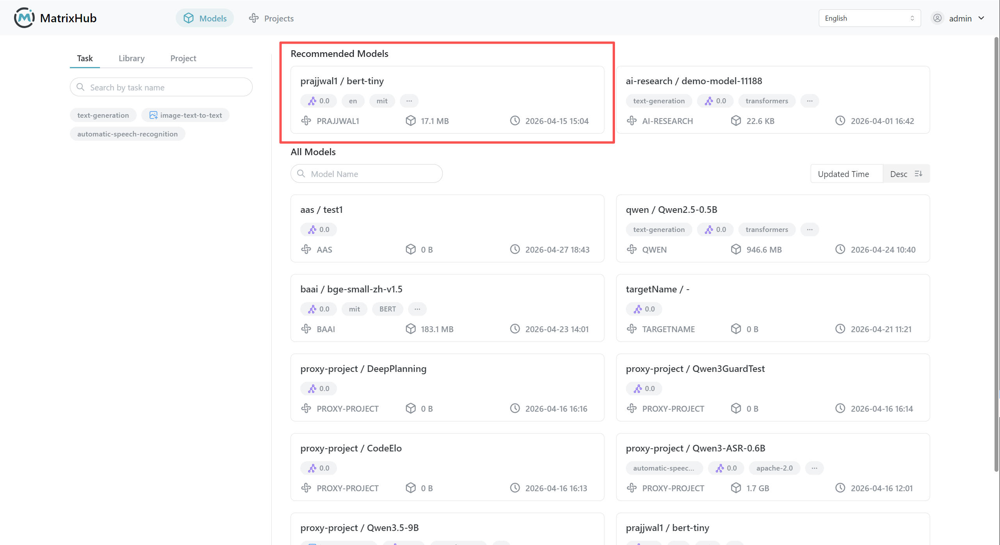

# 模型设置

只有具备**管理员 (admin)** 权限的成员才能编辑 **模型设置** 选项卡。

## 设为热门模型

1. 打开目标模型的详情页面，并切换到 **模型设置**。

1. 启用 **设为热门模型**。

1. 保存后，确认该模型出现在 **模型仓库** -> **热门模型** 下。

    

:::note

- 设为热门后，平台用户可以在热门列表中看到该模型。

:::

## 删除模型

1. 打开目标模型的详情页面，并切换到 **模型设置**。

1. 点击 **删除模型**。

1. 在确认对话框中，输入项目名称并确认删除。

:::warning

删除模型操作不可撤销。请在继续操作前进行备份。

:::
