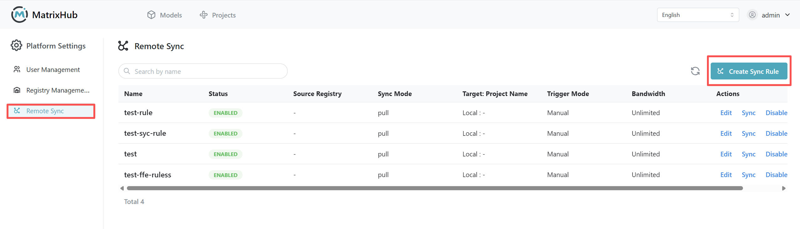

# Remote Synchronization

Remote synchronization is used to pull **Models** or **Datasets** from a remote model repository (such as a configured Hugging Face source) into the current MatrixHub deployment according to specific rules. This is suitable for private scenarios where the platform centrally pulls and updates resources.

## Prerequisites

- **Permissions:** Only **Platform Admins** can create and manage remote synchronization rules.
- **Source Repository:** An available remote source must be configured in **Repository Management**; without a configured source repository, you cannot specify a pull source.
- **Project and Repository:** The **Target Project** is optional; if left blank, resources are stored according to the platform's default rules. **Project** and **Repository** are different concepts, please distinguish them according to the actual interface.

## Steps

1. Log in to MatrixHub with an admin account, go to **Platform Management** in the navigation (or **Platform Settings** under the **Admin** dropdown), and open the **Remote Synchronization** page.

    

1. Click **Create**, fill in the rules in the popup, and save.

    - **Name:** It is recommended to use an easily identifiable identifier (such as English or standardized naming).
    - **Description:** Optional, maximum length is subject to the interface (commonly within 50 characters).

    

1. Configure **Sync Rule** and **Source Repository**, **Resource Filter**, **Target Project**, **Trigger Mode**, **Bandwidth Limit**, etc. (see the **Configuration Parameters** below for details).

1. Click **Confirm** to complete the creation. After creation, you can **Edit**, **Delete** the rule in the list, or trigger a pull via operations like **Sync Now** (specific button names are subject to the interface).

:::note

- The current product primarily focuses on **Pulling** from remote; whether **Pushing** and all options for **Trigger Mode** are supported is subject to the actual version.
- If the interface only provides **Auto** or **Manual**, please operate according to the currently available options.

:::

## Configuration Parameters

| Name | Description |
|------|-------------|
| Name | The display name of the synchronization rule, up to 64 characters, can only contain lowercase letters, numbers, hyphens ("-"), and dots ("."), and must start with a lowercase letter or number. |
| Description | Supplementary explanation for the rule's purpose, within 50 characters. |
| Sync Rule | Select the synchronization direction, currently primarily **Pull**; whether **Push** is supported depends on the version capabilities. |
| Source Repository | Select a remote source already configured in **Repository Management** (e.g., official site, mirror site, or enterprise custom source). |
| Resource Name | Match the resources to be synchronized by name, e.g., `llama-3` or `*` for all. |
| Resource Type | Specify the type of synchronization object, commonly **Model**, **Dataset**, or both. |
| Target Project | The project or workspace to which the synchronized resources will belong, **not required**; if not filled, they are stored according to platform default rules. |
| Trigger Mode | **Manual**: Executes only when clicking sync; **Auto**: Automatically checks and pulls updates according to a periodic policy. |
| Bandwidth Limit | Controls the synchronization download bandwidth. Entering `-1` means no limit; a positive number limits the peak rate according to the interface unit. |
| Overwrite Existing Resources | If checked, resources with the same name will overwrite local versions with the remote ones; if unchecked, it skips if it already exists locally. |
