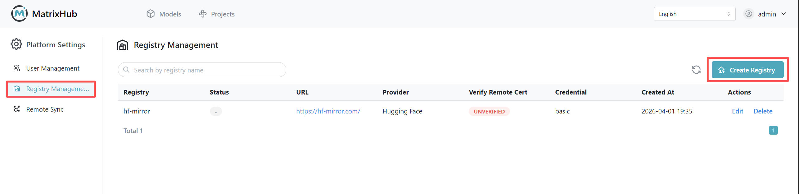

# Repository Management

Repository Management is used to configure the platform's connection information for accessing external model sources (such as Hugging Face, ModelScope, or enterprise internal sources). The repository created here serves as an **upstream data source connector**, which will be selected as the **Source Repository** in **Remote Synchronization**.

## Prerequisites

- **Permissions:** Only **Platform Admins** can create and manage repository configurations.
- **Network Connectivity:** The environment where MatrixHub is deployed must have access to the target URL (e.g., public sources or internal mirrors).
- **Credentials:** If accessing private resources is required, prepare the account password or token in advance.

## Steps

1. Log in to MatrixHub with an admin account, go to **Platform Management** in the navigation (or **Platform Settings** under the **Admin** dropdown), and open the **Repository Management** page.

    

1. Click **Create**, select the provider in the popup, and fill in the repository configuration.

    

1. Fill in fields such as **Repository Name**, **Target URL**, **Authentication Information**, and **Certificate Verification** according to your actual environment (see the **Configuration Parameters** below for details).

1. Click **Confirm** to complete the creation. After creation, you can **Edit** or **Delete** the repository in the list; created repositories can be used as the **Source Repository** on the **Remote Synchronization** page.

## Configuration Parameters

| Parameter | Description |
|-----------|-------------|
| Provider | The upstream protocol or platform type, such as **Hugging Face**, **ModelScope**, or other supported sources. |
| Name | The display name of the current connection configuration, an identifiable alias is recommended (e.g., `HF-Official`, `HF-Mirror`). |
| Target URL | The entry address of the upstream service. Example: `https://huggingface.co`, `https://hf-mirror.com`. |
| Username | The account identifier used to access upstream private resources; can be left blank for public resources depending on the interface requirements. |
| Password / Token | The password or access token corresponding to the username. In the Hugging Face scenario, you usually enter the Access Token here. |
| Verify Remote Certificate | If checked, it verifies the remote TLS certificate. If the remote source uses a self-signed or untrusted certificate, you can uncheck it depending on your environment's policy. |

:::note

- The "repository" in "Repository Management" is not a specific model or dataset address, but a reusable upstream connection configuration.
- To specify exactly which models/datasets to synchronize, you should define rules via resource names and types in **Remote Synchronization**.

:::
