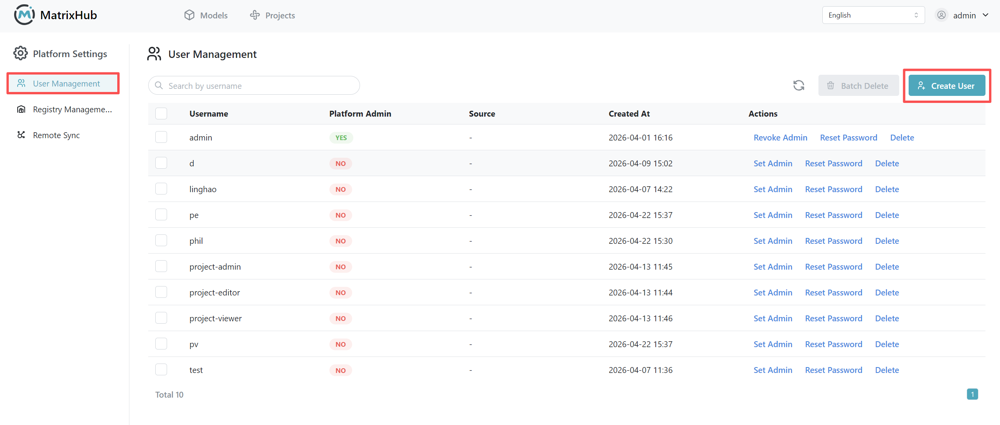
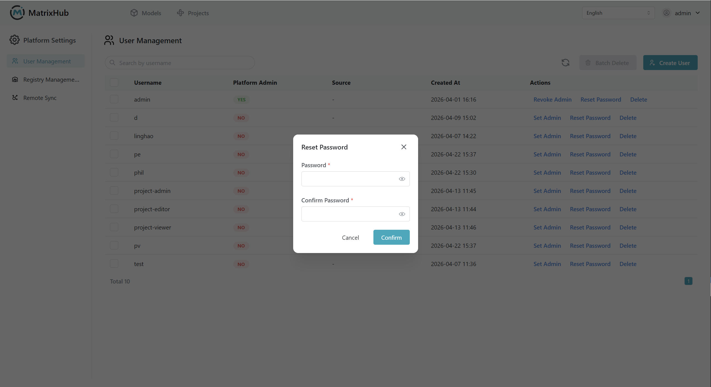

# User Management

Only platform administrators can access and operate the user management functions.

## Prerequisites

- Logged in to MatrixHub with a platform admin account.

## User List Overview

The user management page contains the following information and operations:

| Parameter | Description |
|-----------|-------------|
| Username | The unique identifier of the user account. |
| Platform Admin | Indicates whether the user has platform administrator permissions. |
| Source | The source of the user, supporting **Built-in** or **LDAP**. |
| Creation Time | The time the user account was created. |
| Operations | Supports **Set as Admin**, **Cancel Admin**, **Reset Password**, and **Delete**. |

## Create User

1. Navigate to the **Platform Settings** -> **User Management** page and click **Create User**.
1. Enter the username, password, and confirm password; check **Set as Admin** if necessary.
1. Click **Confirm** to complete the creation.

## Reset Password

1. Find the target user in the user list and click **Reset Password**.
1. Enter the new password and confirm the password.
1. Click **Confirm** to submit.

