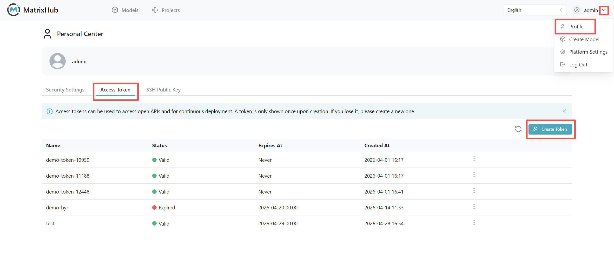
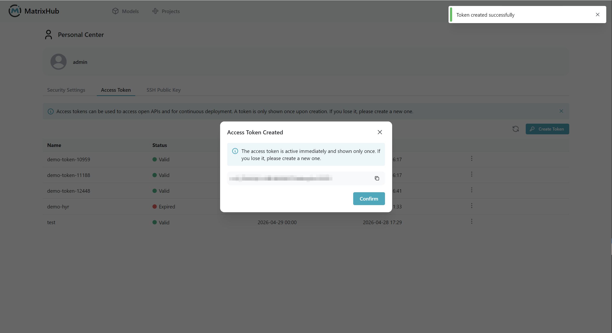

# Access Token

## Prerequisites

- A valid MatrixHub account.
- Access to at least one private repository or public repository (e.g., `my-matrixhub-project/test-mn`).
- Hugging Face CLI installed locally, and the command `hf auth login` is available in your terminal.

## Steps

### Create Access Token

1. Log in to the MatrixHub platform. Go to the **Personal Center** -> **Access Token** page.

    

1. Click **Create Access Token**, fill in a name (e.g., `demo`), select the expiration time (e.g., **Never expires** or a specific duration), and click **Confirm**.

    

1. Once created, a window will pop up displaying the Token. **Copy and save it immediately**, as it will not be shown again.

    

### Use Access Token

1. Configure the service endpoint in your local terminal using your MatrixHub address:

    ```bash
    export HF_ENDPOINT="matrixhub.url" # example: http://127.0.0.1:xxx
    ```

1. Run the login command:

    ```bash
    hf auth login
    ```

1. Enter your saved Token when prompted to complete authentication.

1. Execute a download command to verify access to the **MatrixHub** repository:

    ```bash
    hf download my-matrixhub-project/test-mn
    ```

### Revoke Access Token

1. Go to the **Personal Center** -> **Access Token** page, find the target Token, and perform the delete operation.

1. Once revoked, any CLI operations requiring authentication with that Token will prompt that you are not logged in or the authentication is invalid.

## Configuration Parameters

| Parameter | Description |
|-----------|-------------|
| Name | A descriptive identifier for the Token, useful for distinguishing different purposes. |
| Expiration | Can be set to **Never expires** or a custom date. It will automatically become invalid after this period. |
| Token Value | The actual secret string used for authentication. It is only fully displayed once upon creation and must be copied and saved immediately. |
