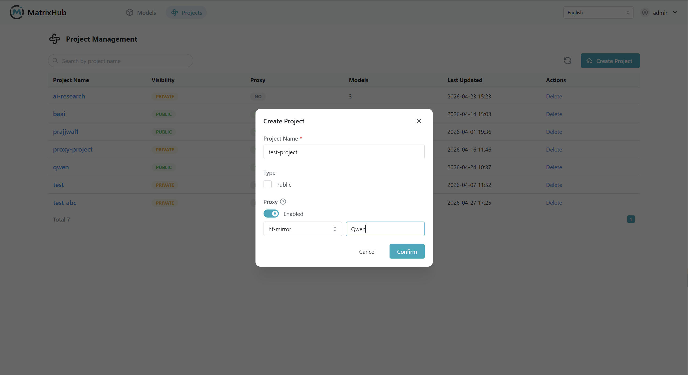

# Create and Delete Projects

## Prerequisites

- Logged into MatrixHub.
- When creating a proxy project, you must first configure the target repository (e.g., Hugging Face) in **Repository Management**.

## Steps

1. After logging in, go to the **Project Management** page to view the project overview.

    

1. Click **Create Project**, fill in the project name, select the project visibility (Public/Private), check **Proxy project** if needed, and click **Confirm**.

    

1. Once created, the new project will appear in the project list, and the creator will automatically be assigned **Admin permissions** for that project.

1. To delete a project, locate the target project in the project list and perform the deletion operation.

:::warning

Deleting a project cannot be undone. Please ensure you have backed up models and data within the project before proceeding.

:::

## Configuration Parameters

| Parameter | Description |
|-----------|-------------|
| Project Name | Only supports lowercase letters, numbers, and hyphens (`-`); must start and end with a letter or number. |
| Visibility | **Public**: Other users can see this project in Project Management. **Private**: Visible only to project members. |
| Proxy project | Check this to enable proxy access via the target repository. |
| Target repository | Required for proxy projects (e.g., Hugging Face). |
| Organization/Username | If the model path is `Organization/ModelName` (e.g., `Qwen/Qwen3.5-35B-A3B`), fill in the Organization; for personal account models, fill in the Username. |

## Project Rules

- **Who can create projects:** Users with project creation permissions can create projects.
- **Roles after creation:** The creator automatically becomes the **Admin** of the project.
- **Public project visibility:** Non-member users can see public projects in the project list.
- **Private project visibility:** Hidden from non-member users by default.
- **Proxy project access:** Public models can be downloaded; private models remain subject to the target repository's access controls.

## Naming Rules Examples

| Type | Examples |
|------|----------|
| Valid Names | `test-project1`, `t1`, `1test2`, `test-project`, `test`, `12` |
| Invalid Names | `t`, `-test`, `test 01`, `test%123`, `test*123`, `test~01`, `test@#$^&*()+=01`, `1test-`, `Test` |
