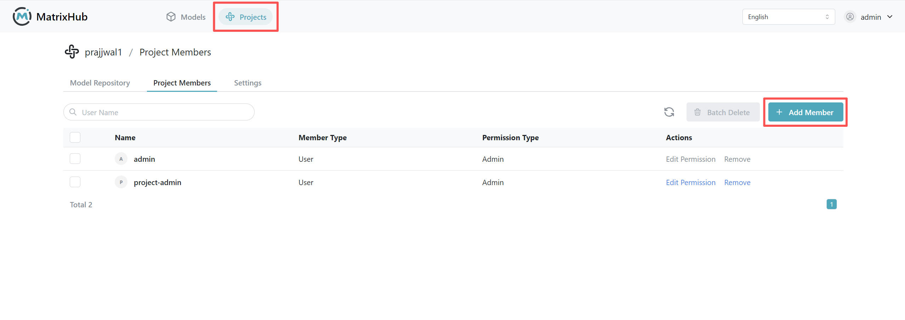
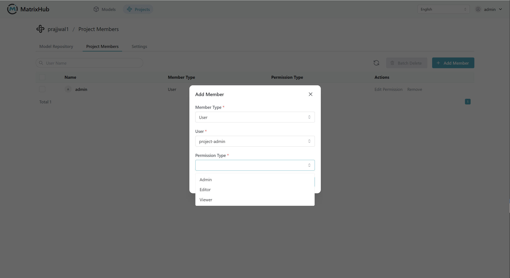

# Project Members

## Prerequisites

- The current account is a project **Admin** or platform **Admin**.
- The target user has an account created on the platform.

## Steps

1. Log in to MatrixHub, go to **Project Management**, select the target project, and click the **Project Members** tab.

    

1. Click **Add Member**, select the member type, user, and permission type in the popup, then click **Confirm**.

    

1. Locate the target user in the member list, click **Edit Permissions**, select a new permission type, and confirm.

    

## Configuration Parameters

| Parameter | Description |
|-----------|-------------|
| Member Type | Currently supports selecting **User**. |
| User | The account to be added to the project. |
| Permission Type | **Admin**: Can manage members and maintain project resources; **Developer**: Can upload, download, and delete models and datasets; **Viewer**: Can only view and download models and datasets. |

## Role Permissions

| Role | Menu Permissions | Core Function Permissions | Special Notes |
|------|------------------|---------------------------|---------------|
| Platform Admin | Can view all menus | Can use all platform functions | Highest platform permission |
| Project Admin | No platform settings menu | Add/edit/remove members, upload/download/delete models and datasets, delete project | Cannot remove themselves from the current project |
| Project Developer | No platform settings menu | View members, upload/download/delete models and datasets | No member management or project deletion permissions |
| Project Viewer | No platform settings menu | View members, download models and datasets | No upload, delete, or member management permissions |
| Regular User (Non-member) | No platform settings menu | Can view and download models/datasets of public projects | Private projects are hidden by default |

## Visibility Supplement

- Only project **Admins** and platform **Admins** can modify project settings.
- Project **Developers** and **Viewers** can view settings but cannot modify them.
- Non-members cannot see the project content by default (except for public resources).
